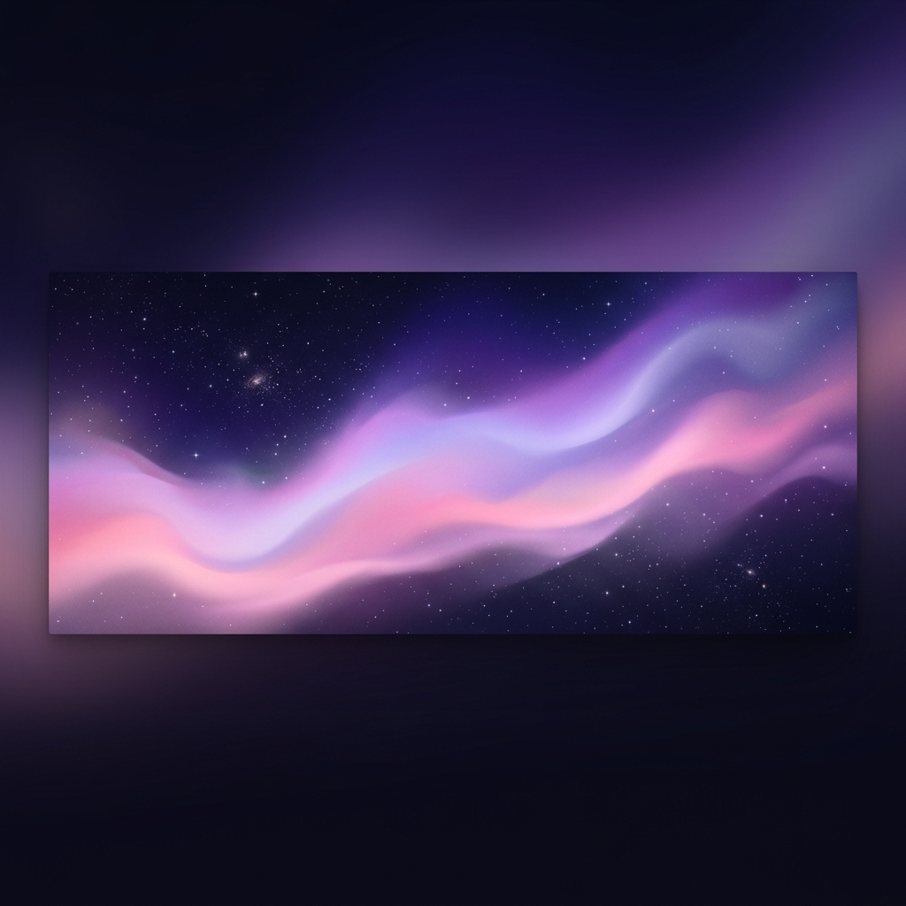

 

  
  
  
  

 

<h2 align="center">  <em>About  me </em></h2>

 

  Hello There! <em><b> I'm Gani Abi Saputra Van Sigu </b></em>, a Informatic student. I enjoy learning new technologies and problem solving at Codeforces and Codechef. Now I'm working at some little and fun projects to put in practice my knowledge about JavaScript, React, Bootstrap and more.

 

      <em><b> Studying at the National University of Costa Rica (UNA) </b></em>  
      <em><b> Private tutor in C++ at the University </b></em> 
      <em><b> Competitor in the ICPC (2025 - 2026) </b></em> 
      <em><b> Chess Player  </b></em> 

 
 
<h2 align="center">  <em> Technologies </em> </h2>

  
  
  
  
  
  
  
  
  
  
  
  
  
  
  

 

<h2 align="center">  <em> Statistics </em> </h2>

 

